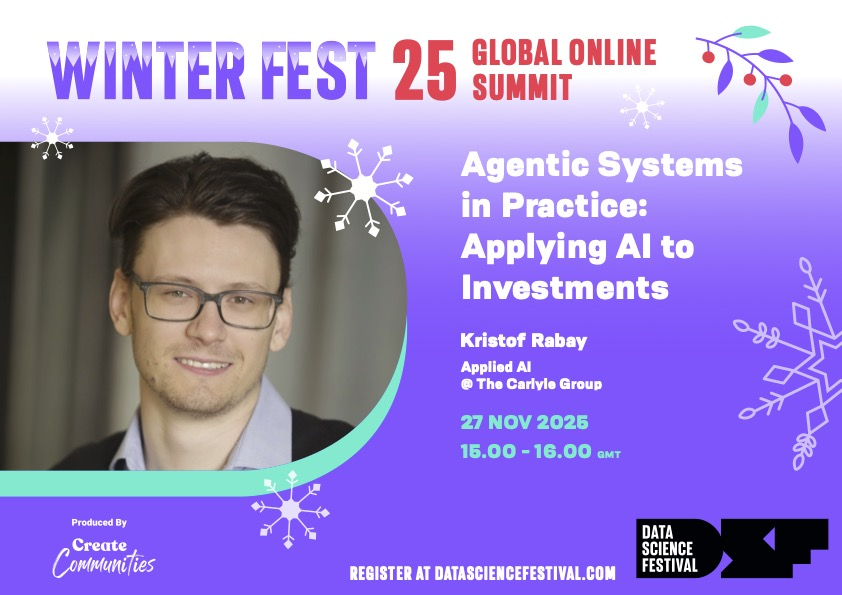
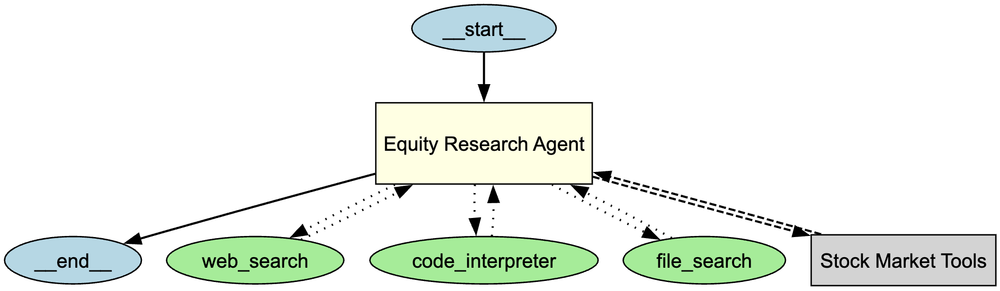
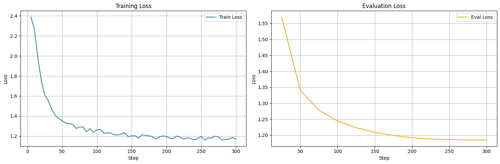

# Agentic Systems in Practice: Applying AI to Investments
**❄️ Data Science Festival WinterFest 2025**



*Kristof Rabay - Applied AI @ The Carlyle Group*  
*November 27, 2025*

---

> **⚠️ Disclaimer:**  
> The views and opinions expressed in this presentation are those of the speaker alone and do not reflect the official policy, position, or views of The Carlyle Group or its affiliates.

---

## 📋 Agenda

1.  [**The Objective:** Why are we here?](#1-objective)
2.  [**The Timeline:** From Chatbots to Autonomous Agents (2022-2025).](#2-the-acceleration-era-a-3-year-journey)
3.  [**Stage 1:** Building our Research Agent (Prototyping).](#3-stage-1-the-research-agent-prototyping)
4.  [**Stage 2:** Creating our Custom Analyst Model.](#4-stage-2-the-analyst-model-customization)
5.  [**Conclusion:** The Future of Applied AI Architectures.](#5-conclusion)

---

## 1. 🎯 Objective <a name="1-objective"></a>

**To demonstrate how modern AI capabilities enable rapid prototyping of complex workflows, and how one can leverage Context Engineering and Fine-Tuning to turn generic models into specialized enterprise tools.**

---

## 2. ⏳ The Acceleration Era: A 3-Year Journey <a name="2-the-acceleration-era-a-3-year-journey"></a>

> **TL;DR:**  
> **Diverging Paths to Excellence:**  
> 1. **Fine-Tuning:** Some (like OpenAI) are creating specialized "snapshots" of models aligned to specific behaviors (e.g., Deep Research).  
> 2. **Context Engineering of Agentic Systems:** Others (like Anthropic) are building multi-agent collaborations where "Planner" and "Worker" models decompose tasks to achieve complex goals.

We have witnessed an explosion in AI capabilities - in just 3 years, we moved from simple text completion to autonomous agents capable of deep research and reasoning.

### 2.1 2022-2023: The "API" Era 👶
*   **[Nov 2022](https://openai.com/index/chatgpt/)** **gpt-3.5-turbo** launches. The world wakes up to AI.
*   **[June 2023](https://openai.com/blog/function-calling-and-other-api-updates):** **Function Calling**. LLMs get "hands" to touch external tools.
    *   *Impact:* We moved from brittle `regex` parsing to native tool execution.

### 2.2 2024: The "Agentic" Shift 🧠
*   **[Sept 2024](https://openai.com/index/learning-to-reason-with-llms/):** **OpenAI o1-preview**. The first "Reasoning" model.
    *   *Shift:* Models start "thinking" before speaking.
*   **[Oct 2024](https://github.com/openai/swarm):** **Agents SDK (Swarm)**. Orchestration becomes a first-class citizen.
*   **[Nov 2024](https://www.anthropic.com/news/model-context-protocol):** **Anthropic MCP**. A universal standard for connecting AI to data.
    *   *Impact:* No more writing custom integrations for every data source.

### 2.3 2025: Deep Research, Autonomy & Fine-tuning 🚀
*   **[Jan 2025](https://github.com/deepseek-ai/DeepSeek-R1):** **DeepSeek R1**. Open-source reasoning matches proprietary models.
*   **[Feb 2025](https://openai.com/index/introducing-deep-research/):** **OpenAI Deep Research**.
    *   *Capability:* A snapshot of an o3-fine-tune to navigate the web
*   **[Jun 2025](https://www.anthropic.com/engineering/multi-agent-research-system)**: **Anthropic Deep Research**.
    *   *Capability:* A planner - worker multi-agent team setup for deep research
*   **[Sept-Nov 2025](https://openai.com/index/introducing-upgrades-to-codex/)**: Coding-specific snapshots of 'base' models
    *   *Capability:* Autonomous coding agents that can maintain context for days.
*   **[Nov 2025](https://openai.com/index/gpt-5-1-codex-max/)** **GPT-5.1-Codex-Max**.
    *   *Capability:* **The 24-Hour Agent.** Can work independently on complex tasks for over a day without human intervention.

---

## 3. 🏗️ Stage 1: The Research Agent (Prototyping) <a name="3-stage-1-the-research-agent-prototyping"></a>

> **TL;DR:**  
> **Rapid Prototyping:**  
> Solutions that took months to build in 2023 are now 10 lines of code. **Why?**  
> *   **Capable Reasoning Models:** No more complex prompt chains to force logic.  
> *   **Effective Tool Usage:** Models now natively understand when and how to call external APIs.

To solve our Equity Research problem, we started with **Prototyping**. We built a "General Purpose" Research Agent using the best proprietary models available today.

### 3.1 The Stack
*   **Model:** `GPT-5.1` (High Intelligence, High Cost)
*   **Connectivity:** **Model Context Protocol (MCP)**
    *   *Why MCP?* It allowed us to plug in Yahoo Finance, Internal Docs, and Web Search standardly.

### 3.2 🛠️ Tools in Action
The agent autonomously decides which tool to use:
1.  **🌐 Web Search:** For real-time competitor news.
2.  **📂 Internal Docs (RAG):** For proprietary investment mandates.
3.  **📈 Stock Market MCP:** For live price history and financials.
4.  **🐍 Code Interpreter:** For calculating valuation metrics on the fly.



### 3.3 🔧 Context Engineering: Optimizing Tool Use

To get the best performance from our "General Purpose" Research Agent, we implemented a structured prompt engineering strategy.

```xml
<system_prompt>
    <role_and_objective>
        You are a research analyst conducting comprehensive research...
        Your objective is to collect exhaustive, unbiased information...
    </role_and_objective>

    <analysis_scope>
        # Competition
        # Financial Analysis
        # ...
    </analysis_scope>

    <tools>
        # Internal / External search
        # MCP servers
    </tools>

    <output_expectations>
        Dos and Don'ts
    </output_expectations>
</system_prompt>
```

One of the biggest challenges in agentic systems is "context management."

*   **The Problem:** Overloading the context window with too long prompts and too many tool definitions takes away space for analysis and more importantly - confuses the model.
*   **The Solution:** **[Advanced Tool Use](https://www.anthropic.com/engineering/advanced-tool-use).**
    *   *Strategy:* Don't just dump all tools. Use a "Router" or "Planner" step to select *only* the relevant tools for the current step.
    *   *Optimization:* Combine reasoning and action. Instead of `Reason -> Tool Call -> Reason -> Tool Call`, allow the model to write a **script** that executes multiple steps at once.

> "By enabling the model to write execution scripts across tools, we reduce the Reasoning-Action chain latency and cost." — *Inspired by Anthropic Engineering*


---

## 4. 🧠 Stage 2: The Analyst Model (Customization) <a name="4-stage-2-the-analyst-model-customization"></a>

> **TL;DR:**  
> **The Democratization of Fine-Tuning:**  
> *   **Accessible:** New frameworks (Unsloth, Axolotl, MLX-Mac) allow fine-tuning SLMs on consumer hardware. Building your own model is now public knowledge.  
> *   **Difficult:** The challenge has shifted from "How do I train?" to **"How do I get good data?"**
> *   **SFT vs RL:** It's about designing data (Supervised Fine-Tuning) vs designing reward functions (Reinforcement Learning) to align with SMEs.

While the Research Agent is powerful, it is **generic** and **expensive**. To scale, we needed a specialist.

### 4.1 The Pivot: Prototyping ➡️ Production
We didn't just want "an answer"; we wanted **OUR** answer.

*   **Context Engineering:** We utilized the Research Agent to generate thousands of synthetic "Reasoning Traces" (Chain of Thought).
*   **Fine-Tuning:** We distilled this intelligence into a smaller, faster, open-source model (`Qwen3-4B-Thinking`).

### 4.2 📚 Emerging Research in Specialized Fine-Tuning
We are seeing a clear trend in the industry: **Small, specialized models are outperforming large generalists on narrow tasks.**

1.  **[xRouter (Oct 2025)](https://arxiv.org/pdf/2510.08439):** A 7B model fine-tuned specifically for **Tool Calling** and routing, optimizing cost-performance.
2.  **[FARA-7B (Nov 2025)](https://www.microsoft.com/en-us/research/blog/fara-7b-an-efficient-agentic-model-for-computer-use/):** A Microsoft model fine-tuned for **Computer Use** (GUI navigation), proving specialized agents don't need 400B parameters.
3.  **[Web Deep Research (Oct 2025)](https://arxiv.org/pdf/2510.15862v3):** A 7B model fine-tuned for autonomous web navigation and research.

> *Note on Architectures:* Even **OpenAI's Deep Research** follows this specialization pattern. It isn't just one giant model; it uses a (1) Search (high level, exploring) and a (2) Fetch (low level, deep dive) toolset, splitting high-level exploration from low-level reading.

### 4.3 The Comparison
| Feature | 🕵️‍♂️ Research Agent (Prototype) | 🧠 Analyst Model (Production) |
| :--- | :--- | :--- |
| **Model** | GPT-5.1 (Proprietary) | Qwen3-4B (Open Source) |
| **Cost** | $$$ per run | ¢ per run |
| **Style** | Generic Helpful Assistant | **Ruthless Investment Analyst** |
| **Speed** | Slow (Reasoning API) | **Lightning Fast** |



---

## 5. 💡 Conclusion <a name="5-conclusion"></a>

We are no longer just "prompting" models. We are **architecting** systems.

1.  **Pushing Limits:** We can take existing models to their absolute limits with clever **Context Engineering**.
2.  **Creating New Value:** We can create infinite variations of specialized models using **Classical Data Science**.
    *   *The Shift:* Spend 75% of your time on **Data** and **Reward Function Engineering**.
    *   *The Goal:* Tremendous alignment with SMEs by defining exactly what is penalized and what is rewarded.
